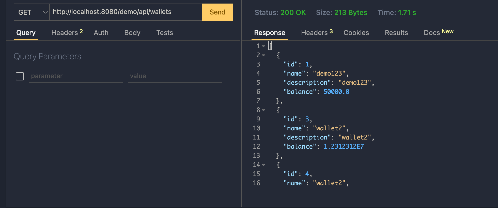
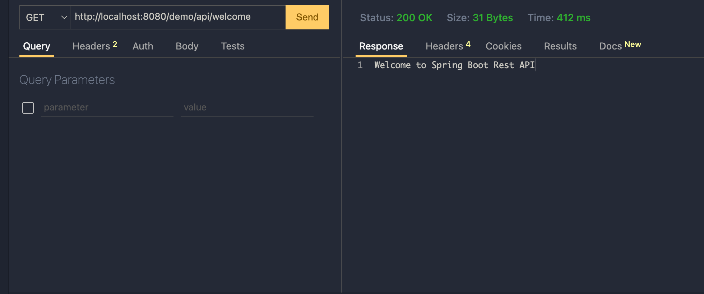

# Getting Started

Repo build based on Youtube - Belajar Membangun RestAPI dengan Spring Boot Framework - Bahasa Indonesia
by Kelas Koding - [https://www.youtube.com/watch?v=Z0JfmObjKRw](https://www.youtube.com/watch?v=Z0JfmObjKRw)

# Database
On this repo we are using mysql on docker host with `spring_wallet` table, you can edit `src/main/resources/application.properties`
```
host.docker.internal:3306/spring_wallet
```

# How to run in docker

- run docker.sh
- build war file using : `mvn package`
- copy .war file to docker : `docker cp target/wallet-0.0.2-SNAPSHOT.war wildfly:/demo.war`
- go to docker shell and copy .war file to wildfly deployment :
```
sh-4.2$ cd /  
sh-4.2$ cp demo.war /opt/jboss/wildfly/standalone/deployments
```
- wildfly will deploy this demo.war
- your api will be available at `http://localhost:8080/demo/api/wallets`


